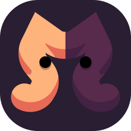
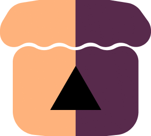
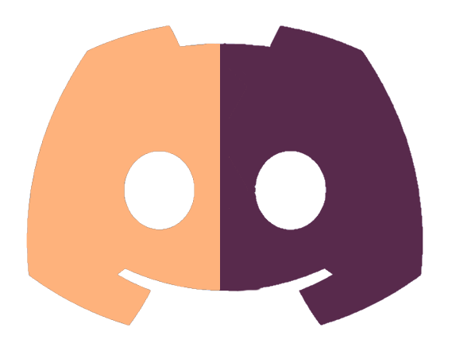
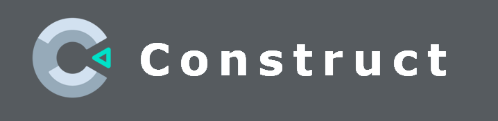

  

<h1 align="center">
SandStone
</h1>

<h3 align="center">
Студия разработки игр и десктопных приложений
</h3>

---

  
   
  <a href="https://sandstone-studio.itch.io/"><h2 align="center">itch.io</h2></a>

  
   
  <a href="https://discord.gg/GZAXy5CKM9"><h2 align="center">Discord</h2></a>

  
   
  <a href="https://sandstone.fun"><h2 align="center">Website</h2></a>

<h1 align="center">
Технологии которые мы используем
</h1>

    

  
  

   

